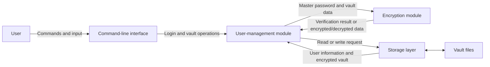

# Secure Password Manager

# Checkpoint 1 — Threat Model and Architecture
## 1. Architecture

The password manager will be a command-line program written in C++. It will
contain a user interface, a user-management module, an encryption module and a
storage layer.

The command-line interface receives commands and input from the user. It checks
the input before sending it to the user-management module.

The user-management module handles registration, login and access to vault
entries. It checks that each user accesses only their own vault.

The encryption module derives an encryption key from the master password. It
encrypts the vault before it is saved and decrypts it after a successful login.

The storage layer reads and writes user information and encrypted vault files.
The master password and plaintext credentials are not stored on disk.

When a user logs in, the program loads the user's information and encrypted
vault from storage. The encryption module checks the master password and
decrypts the vault. When the user changes an entry, the vault is encrypted
again before the storage layer writes it to disk.

## 2. Threat model

### Master password

**Threat:** An attacker may steal the stored user data and try to guess the
master password.

**Mitigation:** The master password will not be stored in plaintext. Argon2id
and a random salt will be used to create a password hash and derive the
encryption key. The password will also be hidden during input.

### Vault at rest

**Threat:** An attacker may copy, read or modify the vault file.

**Mitigation:** Credentials will be encrypted before they are written to the
file. Authenticated encryption will detect changes to the encrypted data. File
permissions will restrict access to the vault. The program will store vaults in
a fixed directory and will not accept a vault path directly from the user.

### Vault in memory

**Threat:** Decrypted credentials and encryption keys may remain in memory
after they are used.

**Mitigation:** Sensitive information will be kept in memory only when it is
needed. Passwords, plaintext credentials and encryption keys will be cleared
from memory after each operation.

### Interface

**Threat:** Oversized or invalid input may crash the program or cause
unexpected behaviour. Sensitive data could also be exposed through program
output or logs.

**Mitigation:** The program will check the format and maximum length of all
input. User input will not be used directly as a format string. Passwords and
encryption keys will not be printed or written to log files.

## 3. Vault format and cryptographic scheme

Each user will have a separate vault file. Before encryption, the vault data
will use a JSON structure containing a list of credential entries. Each entry
will contain an ID, website name, account username and account password.

The stored vault file will contain:

- a file format version;
- a random salt for key derivation;
- a random nonce;
- the encrypted vault data and authentication tag.

The master password will not be stored in the vault. Argon2id will be used with
the random salt to derive a 256-bit encryption key from the master password.

The vault data will be encrypted using XChaCha20-Poly1305 from the libsodium
library. This algorithm provides both confidentiality and integrity. A new
random nonce will be generated whenever the vault is encrypted. The nonce and
salt are not secret and can be stored with the encrypted data.

The derived encryption key will exist only in memory while the vault is open.
It will not be written to the vault file and will be cleared from memory when
the operation is complete.
